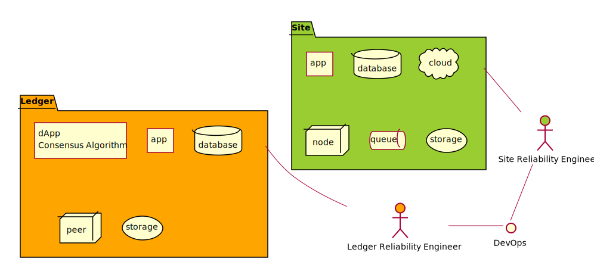

<!-- toc -->

# Ledger Reliability Engineering (LRE)

Ledger Reliability Engineering (LRE) 與 Site Reliability Engineering (SRE) 應用的 DevOps 工具類似，差異在 dApp 的運作模式牽涉到與他人他社的共識互動機制，而且不太可能單一組織內所有應用都是 dApp，故 LRE 也需兼顧 App 維運需要。

目前談到 LRE 這塊的資源較少，故先以收集 SRE 為主。

## TODO

- [Error Budgets](https://landing.google.com/sre/workbook/chapters/implementing-slos/) 跨組織代幣化設計，並改為 Consensus Budgets。
- taichu-raw:443/metrics 

# Site Reliability Engineering

- [Awesome Site Reliability Engineering](https://github.com/dastergon/awesome-sre/blob/master/README.md#hiring)
- ["It's dead, Jim": How we write an incident postmortem](https://www.hostedgraphite.com/blog/its-dead-jim-how-we-write-an-incident-postmortem)
- [推薦：Site Reliability Engineering (SRE, 網站可靠性工程)](https://rickhw.github.io/2018/08/03/DevOps/An-Introduction-to-SRE/)

## Implementing SLOs

參照 [The Site Reliability Workbook Chapter 2 - Implementing SLOs](https://landing.google.com/sre/workbook/chapters/implementing-slos/)
建議一開始設計 SLOs

- 選一個想用來定義 SLOs 的應用程式就好，其他的可以後面加進來。
- 確認使用者是誰，就是那個應用程式最佳化後會很高興的人。
- 選那些使用者通用的系統任務或是關鍵活動 (上圖)。
- 畫出高階架構圖，顯示關鍵組件、需求流、資料流與關鍵性的服務依賴，關鍵組件做成下列組合包(上圖分色)。
  - Request-driven 需求導向
  - Pipeline 管道
  - Storage 儲存

Type of service | Type of SLI
-----|:-----
Request-driven |  Availability 
Request-driven |  Latency 
Request-driven |  Quality 
Pipeline | Freshness 
Pipeline | Correctness 
Pipeline | Coverage
Storage | Durability

## Google SRE Books

[Site Reliability Engineering](https://landing.google.com/sre/books/) 

[The Site Reliability Workbook](https://landing.google.com/sre/books/)

## Telemetry Projects

[OpenTelemetry](https://github.com/open-telemetry)
[paritytech/substrate-telemetry](https://github.com/paritytech/substrate-telemetry)
[OpenTelemetry implementation in rust](https://github.com/GregBowyer/opentelemetry-rs)

## SRE Golden Signals

[How to Monitor the SRE Golden Signals](https://medium.com/faun/how-to-monitor-the-sre-golden-signals-1391cadc7524)

- From the Google SRE book: 
  - Latency
  - Traffic
  - Errors
  - Saturation
- USE Method (from Brendan Gregg): 
  - Utilization
  - Saturation
  - Errors
- RED Method (from Tom Wilkie): 
  - Rate
  - Errors
  - Duration

5 Signals

- Rate — Request rate, in requests/sec
- Errors — Error rate, in errors/sec
- Latency — Response time, including queue/wait time, in milliseconds.
- Saturation — How overloaded something is, which is related to utilization but more directly measured by things like queue depth (or sometimes concurrency). As a queue measurement, this becomes non-zero when you are saturated, often not much before. Usually a counter.
- Utilization — How busy the resource or system is. Usually expressed 0–100% and most useful for predictions (as Saturation is probably more useful).

# Chaos Engineering

[Chaos Engineering (混沌工程)](https://rickhw.github.io/2018/10/08/DevOps/Chaos-Engineering/)

# Transactions Per Second (TPS)

[中央銀行數位貨幣（CBDC）芻議 | 名家評論 - 工商時報](https://view.ctee.com.tw/monetary/11266.html)
> 將區塊鏈的去中介化、去中心化除去，成為一個強大的中心化私有區塊鏈，因此，人行CBDC每秒可處理300,000筆交易；在去年的「光棍節」期間，中國所有交易的峰值交易量為每秒92,771筆交易，仍落在人行的規劃範圍之內。傳聞人行的CBDC將在今年11月11日「光棍節」上路，接受最嚴苛的檢驗。

[Facebook announces Libra cryptocurrency: All you need to know | TechCrunch](https://techcrunch.com/2019/06/18/facebook-libra/)
> Every Libra payment is permanently written into the Libra Blockchain — a cryptographically authenticated database that acts as a public online ledger designed to handle 1,000 transactions per second. 

[Hedera Hashgraph, Touted as High-Speed Blockchain Alternative, Now Live - CoinDesk](https://www.coindesk.com/hedera-hashgraph-touted-as-high-speed-blockchain-alternative-goes-live)
> Specifically, Hedera says the network can support up to 10,000 transactions per second, compared to 2.8 per second for bitcoin and 15 for ethereum, the two largest blockchains.

[Hedera Hashgraph — Time for some FUD - Eric Wall - Medium](https://medium.com/@ercwl/hedera-hashgraph-time-for-some-fud-9e6653c11525)
> A dapp requires smart contracts and since Hedera is currently throttling 10 transactions per second with smart contracts, then it doesn’t make this any more interesting than ethereum