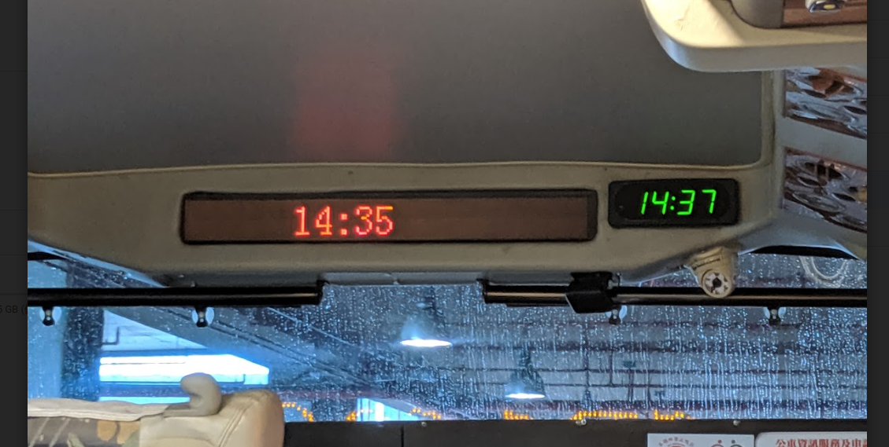

# 書籍與文獻

# TOC
<!-- toc -->

# 報告

## Cambridge Judge Business School: Global Enterprise Blockchain Benchmarking Study
　
[Cambridge Judge Business School: 2nd Global Enterprise Blockchain Benchmarking Study](https://www.jbs.cam.ac.uk/faculty-research/centres/alternative-finance/publications/2nd-global-enterprise-blockchain-benchmarking-study/)

> Hyperledger Fabric appears to be the platform of choice across all industries: Fourty-eight per cent of covered projects that are used in production have chosen Hyperledger Fabric as the core protocol framework underlying the network, followed by R3’s Corda platform (15 per cent) and Coin Sciences’ MultiChain framework (10 per cent).

# 法案

## US NDAA proposes blockchain for national defense

[Text - H.R.2500 - 116th Congress (2019-2020): National Defense Authorization Act for Fiscal Year 2020 | Congress.gov | Library of Congress](https://www.congress.gov/bill/116th-congress/house-bill/2500/text)

SEC. 255. Briefing on use of blockchain technology for defense purposes.

- improve cybersecurity, beginning at the hardware level, of vulnerable assets such as energy, water and transport grids, through distributed versus centralized computing
- reduce single points of failure in emergency and catastrophe decision-making by subjecting the decision to consensus validation through distributed ledger technologies
- improve the efficiency of defense logistics and supply chain operations
- enhance the transparency of procurement auditing
- allow innovations to be adapted by the private sector for ancillary uses

# 金融監管
- 
[区块链技术在证券领域的应用与监管研究 - 上海证券交易所 www.sse.com.cn › publication › actofcourt › law ](http://www.sse.com.cn/aboutus/publication/actofcourt/law/list/a/20190807/10c1f444867fc7b6c66d84f64452a5c3.pdf)

## Embedded supervision

> In DLT-based markets, by contrast, data credibility is assured by economic incentives. In this world, the supervisor must examine the  conditions under which the market’s economic consensus is strong enough to guarantee the quality of the data contained in the distributed ledger. 

[BIS Working Papers No 811 Embedded supervision: how to build regulation into blockchain finance by Raphael Auer](https://www.bis.org/publ/work811.pdf)

> This challenge goes deeper than current discussions on under what circumstances cryptoassets should be considered as commodities, securities  or other asset classes. Rather, it is how to embed the concept of economic finality in today’s legal system, and the adjacent question of how to treat such assets on balance sheets.

# 經濟

## The coming of external intelligence

[Where is technology taking the economy? | McKinsey](https://www.mckinsey.com/business-functions/mckinsey-analytics/our-insights/where-is-technology-taking-the-economy)

[经济学家 Brian Arthur：当工作先于凯恩斯的预测成了稀缺资源，我们的人生意义何在？ - 链闻 ChainNews](https://www.chainnews.com/articles/991116111661.htm)

> 数字技术不仅仅是一种虚拟的经济体，也是外部化的智能。它极大地促进了这些领域的能力，却也在一点一点的抛弃人工劳作。

## 数字货币因数字经济诞生

[经济学家朱嘉明：数字货币因数字经济诞生，绝非传统货币的简单移植 - 链闻 ChainNews](https://www.chainnews.com/articles/323383360421.htm)

> 我的结论是，如果说 21 世纪是人类社会和经济社会生活全方位极具复杂化的世纪，那么数字货币将是这种复杂化的核心所在。

# 常用觀點連結

## 忒修斯之船（英語：ship of Theseus）

- [法庭上的哲學爭議︰假如把零件換掉，還是同一輛車嗎？ - The News Lens 關鍵評論網](https://www.thenewslens.com/article/81168?fbclid=IwAR1p1eNd62jG764_U5Nkaj8L_5XULmA202v0nRK2Le7cl5CmZDlnA49SH_U)
- [忒修斯之船 - 維基百科，自由的百科全書](https://zh.wikipedia.org/zh-tw/%E5%BF%92%E4%BF%AE%E6%96%AF%E4%B9%8B%E8%88%B9)

## 一九八四

「溫斯頓，你相信現實是客觀的、外界的和自我存在的。你相信現實是自明的。當你以為看到某件東西時，你假定別人也像你一樣看見這件東西，但是我告訴你，溫斯頓，現實並不是外界之物，是在人類思想中間。並不是在個人思想中間，因為個人是會犯錯的，是會滅亡的：現實是在黨的思想中，這是集體的，是不朽的。黨認為是真理，這便是真理。」 - 一九八四

- [一九八四](https://zh.wikipedia.org/zh-tw/%E4%B8%80%E4%B9%9D%E5%85%AB%E5%9B%9B)
- [The Real Benefits of Blockchain Are Here. They’re Being Ignored](https://www.coindesk.com/the-real-benefits-of-blockchain-are-here-theyre-being-ignored)
- [為什麼說奧威爾的《1984》可能是在諷喻當今](https://www.bbc.com/ukchina/trad/vert-cul-44333736)
- [《The Matrix》：紅藥丸還是藍藥丸？](https://hypebeast.com/zh/2019/8/keanu-reeves-the-matrix)

## 蜷川實花 MIKA NINAGAWA

> 拍照不是一件從零到一的職業，而是把一的東西變成二，如果沒有一(被攝物)，根本不會有二。

- [蜷川實花 - 維基百科，自由的百科全書](https://zh.wikipedia.org/zh-tw/%E8%9C%B7%E5%B7%9D%E5%AF%A6%E8%8A%B1)
- [MIKA NINAGAWA](https://mikaninagawa.com/)
- [台中花博蜷川實花特展 Eternal scape 永恆的光景](http://www.dribs-drabs.com/blog/post/466385276-mikaninagawa-eternalscape)

## Giorgio Manganelli

> Tutto documentato, tutto arbitrario.

- [Giorgio Manganelli - Wikipedia](https://en.wikipedia.org/wiki/Giorgio_Manganelli)