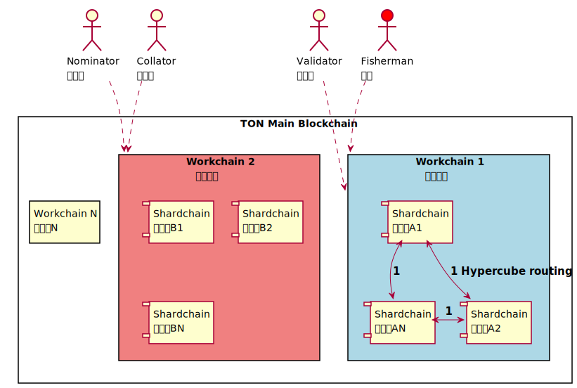

# Crypto-Assets

<!-- toc -->

## Virtual Assets

- [ 2019 Guidance for a Risk-Based Approach to Virtual Assets and Virtual Asset Service Providers](https://www.fatf-gafi.org/publications/fatfrecommendations/documents/guidance-rba-virtual-assets.html)
- [ 2015 FATF虛擬貨幣風險基礎方法指引](https://www.amlo.moj.gov.tw/1461/1469/1473/3069/post)

FATF 指引 RBA-VA-VASPs 用詞可能成為書寫主流用語之一。 2019 版與 2015 版的用詞差異在於新增 AEC ( Anonymity-Enhanced Cryptocurrency ) 與 VC 轉成 VA ( Virtual Asset )，VA 用詞因為包括 VC 估計用法將更為流行。AEC 用詞的出現標誌著該領域已進入監管雷達，後續 AEC 可能轉線下而消失在合規交易所，至於現階段 AEC 合約能見度不高，數年後是否會有 AEVA 用詞於指引出現讓人好奇。

## Crypto Coffee 

[Crypto Coffee Coin Is Coming to Brazil's Countryside Farmers - Bloomberg](https://www.bloomberg.com/news/articles/2019-07-10/crypto-coffee-coin-is-coming-to-brazil-s-countryside-farmers)

咖啡虛擬通貨的最終常用說法會不會是 CoffeeCoin 。

- CoffeeCoin
- CryptoCoffee
- SmartContractCoffee
- CoffeeVirtualAsset
- CoffeeVirtualCommercialPaper
- ScriptAssetCoffee
- PersistentScriptCoffee
- ScriptCoffee
- CodeCoffee

## BAT

Brave browser 開始進軍小螢幕，注意力商人一書裡面提到四個螢幕最後版本就是手機版，Brave browser 安裝後右上角的獅子會有明顯的數字很容易知道這個站台追蹤的資訊，建議邊看注意力商人一書邊看獅子標示更有感。

不過 firefox 隱私保護切到嚴格加上 Facebook Container 或 Ghostery 隱私廣告攔截器等，再掛個 metamask 執行合約也可以逼近 brave browser + BAT 功能，火狐加掛模式好處是不限 BAT 可用各式加密貨幣，缺點是近易用性較低，上手需時間。

[Brave browser now can show its privacy-first ads on Android, too](https://www.cnet.com/news/brave-browser-now-can-show-its-privacy-first-ads-on-android-too/)

## TON

- [TON Blockchain Test Network](https://test.ton.org/)
- [ton-blockchain/ton github](https://github.com/ton-blockchain)
- [Telegram Open Network (TON) 繁中翻譯 2018](https://medium.com/@makersu/telegram-open-network-ton-%E7%B9%81%E4%B8%AD%E7%BF%BB%E8%AD%AF-8bb495f87a75)

## Verifiable Random Function (VRF) 

- [Verifiable Random Functions (VRFs) draft-irtf-cfrg-vrf-05](https://datatracker.ietf.org/doc/draft-irtf-cfrg-vrf/?include_text=1)
- [Algorand 的 draft-irtf-cfrg-vrf-version03](https://github.com/algorand/libsodium/tree/draft-irtf-cfrg-vrf-03)
- [google/keytransparency - github](https://github.com/google/keytransparency)
- [w3f/schnorrkel Schnorr VRFs and signatures on the Ristretto group](https://github.com/w3f/schnorrkel)
- [ontio/ontology-crypto](https://github.com/ontio/ontology-crypto)
- [区块链知识之 VRF: 可验证随机函数](https://www.jishuwen.com/d/2JWW)
- [区块链中VRF的应用及原理解析](https://www.odaily.com/post/5133096)

# TODO

## 201909

- [ ] Polkadot