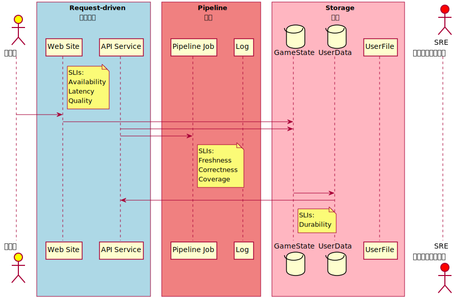

# Libra

[Facebook releases plan for its Libra cryptocurrency to 'meet the daily financial needs of billions of people' - The Block](https://www.theblockcrypto.com/post/27667/facebook-libra-cryptocurrency-calibra-launch)

> "The challenge is that as of today we do not believe that there is a proven solution that can deliver the scale, stability, and security needed to support billions of people and transactions across the globe through a permissionless network," the whitepaper notes, conservatively quoting a throughput capacity of 1,000 transactions per second and a 10-second finality upon launch.

# TOC
<!-- toc -->

# 隨想

## 選 ProtoBuf 型正言順

引用 [区块链安全问题剖析与 Libra 安全点评](https://learnblockchain.cn/2019/08/08/libra-secrity/)

> 单一性依赖问题：Libra 如果完全依赖 RUST 语言实现，那么会存在单一依赖问题，如果 RUST 语言出现安全问题，则会波及整个 Libra 系统，这一点可能需要时间来解决。

關於單一依賴的解決速度可能會比其他專案快一點，因 Libra 選型用的是 Google Protocol Buffers (Protobuf) 格式，從 [immutability-io/vault-libra: A Vault plugin for Libra](https://github.com/immutability-io/vault-libra) 專案出現的時間點可知整合這類已有 Protobuf 規格的專案相對時間會快上許多，除了格式一致讓 Golang 對接 Rust 應用程式較簡易之外，後續要 Java Python Nodejs 要對接或實作也會方便許多。

說到對接方便這件事除了開發，其實也牽涉到運轉處理事件的效率，如 [The Site Reliability Workbook Chapter 2 - Implementing SLOs](https://landing.google.com/sre/workbook/chapters/implementing-slos/) 建議初始的 SLOs Pipeline 管道區，管區裡會接多長與多少段其實開發階段並不一定清楚，平台運轉後遇到事件時可能會有動態的管路配置，如管裡流的是 Protobuf，對於處理事件的 SRE 來說一來上手容易二來工具也多，處理上更有效率。



就公鏈來說每個小型獨立節點一般無設置管路區的必要，有設置管路區需求的是較大型服務商，在收發訊息之間加上各種處理來提供服務。聯盟鏈來說對接的同盟可能都會配管，這時如遇到 [hyperledger/fabric-protos](https://github.com/hyperledger/fabric-protos) 類似的專案，進管前處理與進管後的管道開發管理都會省下不少功夫，可提高整本帳的可靠度。

# TODO

- [【行业报告】《关于 Libra 的多方视角与观点汇总》 - 链闻 ChainNews](https://www.chainnews.com/articles/876847007982.htm)
- [LibraBFT 算法简述 - 链闻 ChainNews](https://www.chainnews.com/articles/900065488880.htm)
- [Libra 是又一个星战计划吗？深度分析数字货币对主权国家的冲击 - 链闻 ChainNews](https://www.chainnews.com/articles/026526704886.htm)

## Move Token Example - etoken-libra 

- [etoroxlabs/etoken-libra: A joyful early experiment of building eTokens on Libra](https://github.com/etoroxlabs/etoken-libra)
- [etoroxlabs/eToken: eToken is stablecoin implementation by eToro targeting the Ethereum platform](https://github.com/etoroxlabs/etoken)


# Protobuf

# 生成 Google Protocol Buffers 文件

[libra/types/src/proto at master · libra/libra](https://github.com/libra/libra/tree/master/types/src/proto)

```shell
git clone https://github.com/libra/libra.git /tmp/src/libra
bash tc.sh --gen-proto-doc /tmp/src/libra/types/src/proto /tmp/output.md
```

{{#include libra-gen-proto.md}}