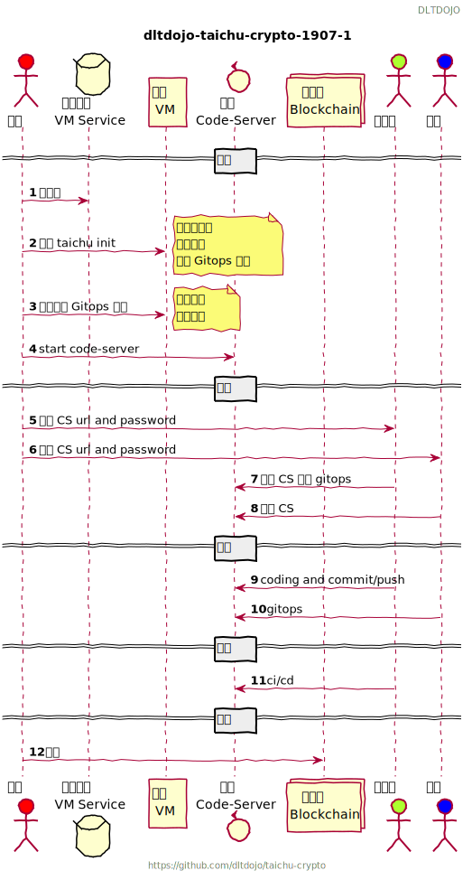
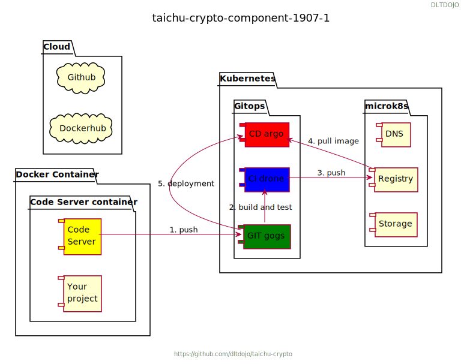

# 第三新熵熱踢道場 (taichu-crypto) 專案簡介

目前版本 {{#include ../../VERSION}} 

道場專案預期做個分散式帳本技術的練習場所，第一次嘗試於 16 年使用 ssh 連線遠端 ubuntu 機器操作指令模式(下稱 SSH-ONLY)，不過界面不易入門學習曲線太高，後來加入 Visual Studio Code@Windows 掛 samba-file-server@ubuntu 來編輯，執行指令還是用 ssh 連接機器模式（下稱 SSH-SMB），由於 IDE 支援 SSH-SMB 學習效率有所增加，不過設定使用方式需要雙協定還是太複雜，隨著 code-server 專案的逐漸成熟，道場練習場設置改為 HTTP-ONLY 模式，學習端只用瀏覽器，不須下載其他軟體安裝或是開啟其他連線工具即可開始進行學習活動。

- SSH-ONLY, SSH-SMB, HTTP-ONLY
- https://code.visualstudio.com/
- https://github.com/cdr/code-server

# 圖說

序列圖



組件圖




- CS cdr/code-server: Run VS Code on a remote server. https://github.com/cdr/code-server
- K8S ubuntu/microk8s: A kubernetes cluster in a snap https://github.com/ubuntu/microk8s

每次活動開啟 VM 建置 microk8s 環境，配置每個練習者一個 CS 環境取得密碼與對外連線 URL，練習者瀏覽器登入後執行練習任務。

## VM 環境與預算

估算基礎單次練習約五人兩小時。

### Digital Ocean 

```
MEMORY  VCPUS   SSD DISK    TRANSFER  PRICE
64GB    16      1,280 GB    9TB	      $0.476/hr
```

# 體驗 

## Web 1.0

- apache http server
- html
- build 
- test
- deploy
