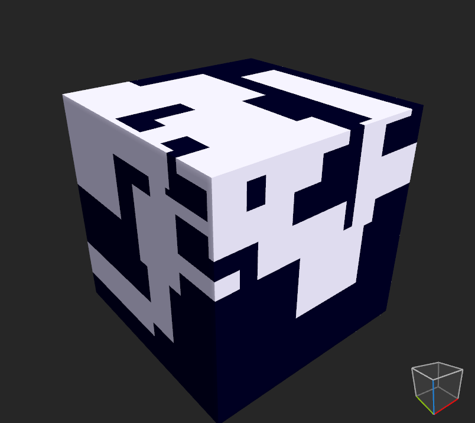

# MAD-RED

# TOC

<!-- toc -->

## Docker + Minecraft = Dockercraft

[docker/dockercraft: Docker + Minecraft = Dockercraft](https://github.com/docker/dockercraft)

> A simple Minecraft Docker client, to visualize and manage Docker containers.

容器啟動或關閉都可在 minecraft 裡面執行，後續可考慮實作成不須 minecraft 的 veloren 模式。

## the future you dream of never comes true

[Ludwig Wittgenstein - Wikipedia](https://en.wikipedia.org/wiki/Ludwig_Wittgenstein)

> You can't build clouds. And that's why the future you dream of never comes true. — Ludwig Wittgenstein

