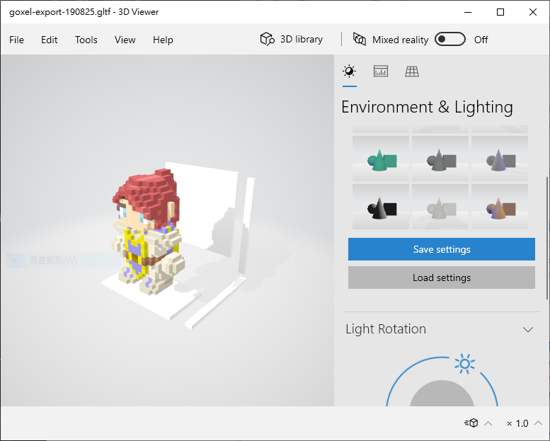
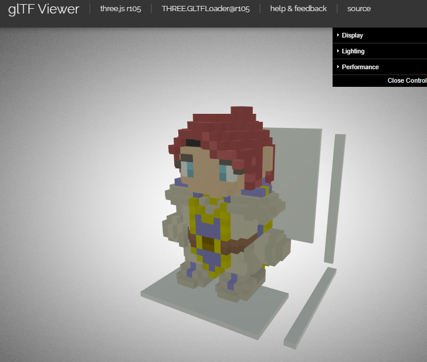

# Vox 組件開發編輯

veloren 的組件為 vox 檔，可使用 MagicaVoxel 或是 Goxel 編輯體素遊戲組件 vox 檔。

- [MagicaVoxel @ ephtracy (Win/Mac)](https://ephtracy.github.io/)
- [Goxel: Free and Open Source 3D Voxel Editor (Win/Mac/Linux/Android) ](https://github.com/guillaumechereau/goxel)

# MagicVoxel 

## 道場示意模型 40x40x40


## MV vox 組件庫

CC BY 姓名標示 (Creative Commons Attribution)

[Mini Mike's Metro Minis 城市物件](https://github.com/mikelovesrobots/mmmm)

商業

[voxelmodel tag - Sketchfab](https://sketchfab.com/tags/voxelmodel)

# Goxel 

輸入 vox 檔編輯


# 3D Model Viewer

匯出 glTF (GL Transmission Format) 不過不能匯入，匯出後 glTF 檔案可由 3D Viewer App 開啟。



[Drag-and-drop preview for glTF 2.0 models in WebGL using three.js.](https://github.com/donmccurdy/three-gltf-viewer)



[hujiulong/vue-3d-model](https://github.com/hujiulong/vue-3d-model) 單頁展示

```html
<body>
    <div id="app">
        <model-gltf 
            src="static/models/gltf/Duck/glTF/Duck.gltf"
            @on-mousemove="onMouseMove">
        </model-gltf>
    </div>
    <script src="vue.js"></script>
    <script src="vue-3d-model.min.js"></script>
    <script>
        new Vue({
            el: '#app'
        })
    </script>
</body>
```

## 參考連結

- [A complete guide to importing from MagicaVoxel to Sketchfab](https://sketchfab.com/blogs/community/complete-guide-importing-magicavoxel-sketchfab/)
- [aframe and magicavoxel ](https://github.com/ngokevin/aframe-magicavoxel-projects)
- [MagicaVoxel 教 & 玩| 三米 SamMi](https://www.youtube.com/playlist?list=PLj0OweJfMlSGY0fqztkTmNLyj741_2Ufu)
- [magicavoxel - github](https://github.com/search?q=magicavoxel)
- [magicavoxel - twitter](https://twitter.com/hashtag/magicavoxel)
- [用 MagicaVoxel 做点小东西](https://ook.dev/posts/2019/magicavoxel/)
- [十分钟打造 3D 物理世界](https://aotu.io/notes/2018/10/18/cannonjs/index.html)