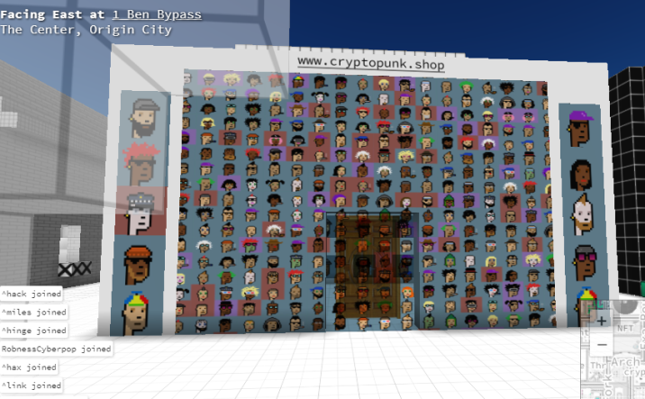

# Voxel 相關專案
<!-- toc -->
## Aframe

- [Easily customized environments using the Aframe-Environment-Component](https://blog.mozvr.com/aframe-environment-component/)
- [supermedium/aframe-environment-component](https://github.com/supermedium/aframe-environment-component)


[aframe-env.html 測試網頁](aframe/aframe-env.html)

```html
{{#include aframe/aframe-env.html}}
```

## (WIP) Cryptovoxels 

Babylon.js Ethereum TypeScript

- [Cryptovoxels](https://github.com/cryptovoxels)
- [Cryptovoxels | 致我们的平行宇宙 | | 资讯 | DOGIgames](https://www.dogigames.com/cn/news-cn/2019/07/18/13198.html)
- [Magicavoxel support for Cryptovoxels](https://medium.com/@bnolan/magicavoxel-support-for-cryptovoxels-b961e0babf80)
- [Cryptovoxels Trailer - youtube](https://www.youtube.com/watch?v=PMAkpeyWGWA)
- [I took a virtual walk in the blockchain so you don’t have to](https://thenextweb.com/hardfork/2019/04/05/cryptovoxels-walk-blockchain-ethereum/)
- [体素沙盒区块链游戏《Cryptovoxels》独立开发者Ben Nolan专访](https://www.jbb.one/en/article/1129958400.html)



