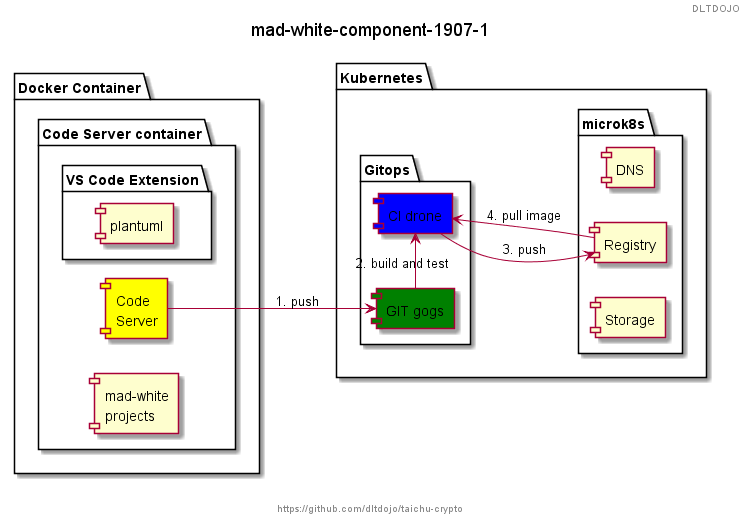

# MAD WHITE

MAD WHITE 目的為試驗使用 [cdr/code-server](https://github.com/cdr/code-server) 專案的 [codercom/code-server](https://hub.docker.com/r/codercom/code-server) image 為基底做出區塊鏈學習環境建置用 image ，目標是學習端不需安裝除了瀏覽器之外的軟體，就能學習、驗證與撰寫各種線上教材的設計學習情境。

<!-- toc -->

# Getting Started

## 如何使用 docker image 啟動

Docker 標籤為 dltdojo/ddj3base:mad-white

- https://hub.docker.com/r/dltdojo/ddj3base/tags

```shell
bash tc.sh --drun
```

or 

```shell
docker run -it --rm -p 8443:8443 -v "${PWD}:/home/coder/project" \
  dltdojo/ddj3base:mad-white --allow-http --no-auth 
```

Dockerfile 繼承自 codercom/code-server 再加上練習所需工具。

```docker
{{#include ../../../poc/mad-white/ddj3base/mad-white/Dockerfile}}
```

## Kubernetes 

```shell
bash mad-white.sh install|delete|info
```

###  WIP Steps

- gogs must wait at least 3 mins
- gogs url http://127.0.0.1:30521
- register alice@gogs and create a new project
- drone url http://127.0.0.1:30531
- login drone with alice@gogs's password


### WIP 圖說

組件圖



# TODO

## 201909

- [ ] [code-sever docker v2 test](https://hub.docker.com/r/codercom/code-server/tags)
- [ ] [[v2] Rewrite code-server to use new web stuff](https://github.com/cdr/code-server/pull/857)