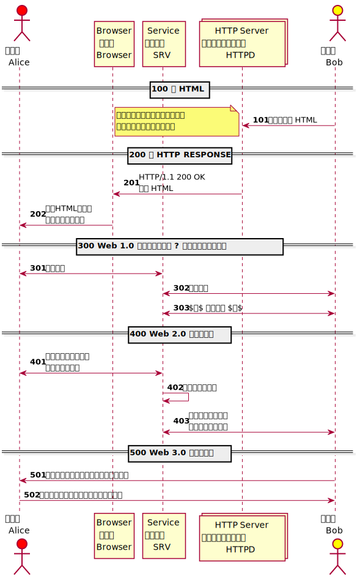
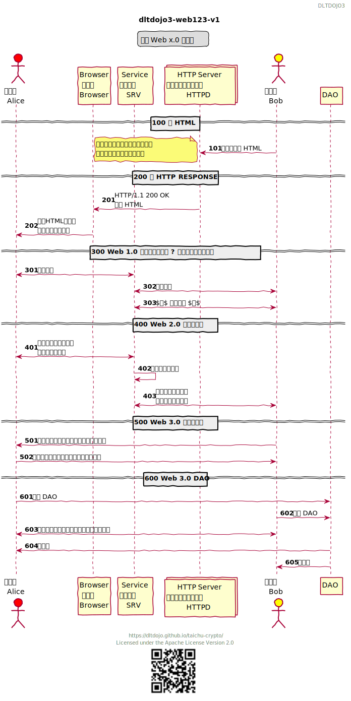
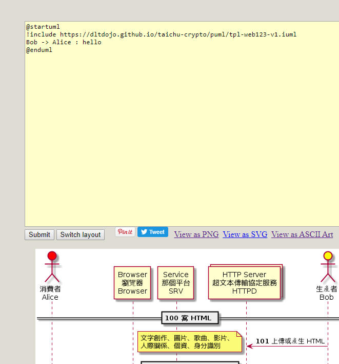
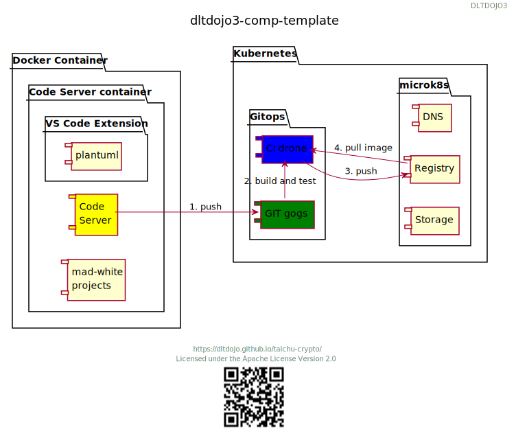

# PlantUML
<!-- toc -->

# 如何使用模板 

先看過 [Preprocessing - PlantUML](http://plantuml.com/preprocessing)，模板採用 iuml 副檔名前面加上 tpl，引入語法如下。

```
!include tpl-web123-v1.iuml
```

## 使用 tpl-web123-v1 解說 DAO



tpl-web123-v1.iuml 內容

```
{{#include puml/tpl-web123-v1.iuml}}
```

## 套版加上 DAO 的說明



web123-v1.puml 套用模板

```
{{#include puml/web123-v1.puml}}
```

## PlantUML Online Demo Service 效果

如要外部使用可以利用下列連結，利用線上服務 [PlantUML Online Demo Service](http://www.plantuml.com/plantuml/uml) 利用下列方式加入模板。



```
!include https://dltdojo.github.io/taichu-crypto/puml/tpl-web123-v1.iuml
```

# 時序圖樣版 Sequence Diagram Template

[Sequence Diagram - PlantUML](http://plantuml.com/sequence-diagram)

## tpl-web123-v1.iuml


tpl-web123-v1.iuml 內容

```
{{#include puml/tpl-web123-v1.iuml}}
```

# 組件圖樣板 Component Diagram Template

[Component Diagram - PlantUML](http://plantuml.com/component-diagram)

## WIP tpl-dltdojo3-x



```
{{#include puml/comp-template.puml}}
```