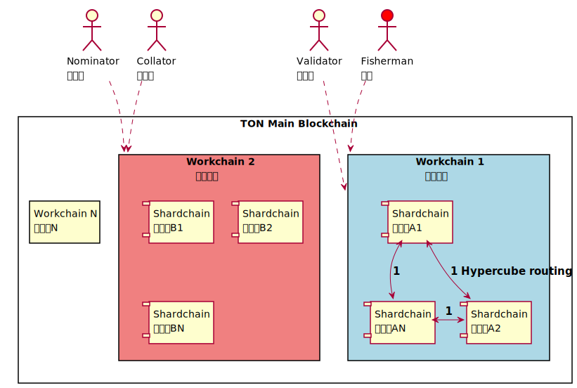

# PlantUML
<!-- toc -->

# 如何使用模板 

先看過 [Preprocessing - PlantUML](http://plantuml.com/preprocessing)，模板採用 iuml 副檔名前面加上 tpl，引入語法如下。

```
!include tpl-web123-v1.iuml
```

## 使用 tpl-web123-v1 解說 DAO


tpl-web123-v1.iuml 內容

```
{{#include puml/tpl-web123-v1.iuml}}
```

## 套版加上 DAO 的說明


web123-v1.puml 套用模板

```
{{#include puml/web123-v1.puml}}
```

## PlantUML Online Demo Service 效果

如要外部使用可以利用下列連結，利用線上服務 [PlantUML Online Demo Service](http://www.plantuml.com/plantuml/uml) 利用下列方式加入模板。

引用

```
!include https://dltdojo.github.io/taichu-crypto/puml/tpl-web123-v1.iuml
```


# 時序圖樣版 Sequence Diagram Template

[Sequence Diagram - PlantUML](http://plantuml.com/sequence-diagram)

## Web3.0 概念: tpl-web123-v1.iuml 


內容

```
{{#include puml/tpl-web123-v1.iuml}}
```

引用

```
!include https://dltdojo.github.io/taichu-crypto/puml/tpl-web123-v1.iuml
```

## HTTP 概念: tpl-story-http-v1.iuml 


內容

```
{{#include puml/tpl-story-http-v1.iuml}}
```

引用

```
!include https://dltdojo.github.io/taichu-crypto/puml/tpl-story-http-v1.iuml
```

## Exit, Voice and Loyalty《叛離、抗議與忠誠》: tpl-evl-v1.iuml

[Joystream - Github](https://github.com/Joystream) 的 DAO 治理結構針對組織的 [Exit, Voice, and Loyalty - wikipedia](https://en.wikipedia.org/wiki/Exit,_Voice,_and_Loyalty) 問題加以設計，希望探索或建構出可長久的組織結構。


內容

```
{{#include puml/tpl-evl-v1.iuml}}
```

引用

```
!include https://dltdojo.github.io/taichu-crypto/puml/tpl-evl-v1.iuml
```

## The Site Reliability Workbook Ch2 - Implementing SLOs : tpl-sre-slos-v1.iuml


內容

```
{{#include puml/tpl-sre-slos-v1.iuml}}
```

引用

```
!include https://dltdojo.github.io/taichu-crypto/puml/tpl-sre-slos-v1.iuml
```

## Crypto Custody : tpl-custody-fork-v1.iuml

[The Crypto Custody Conundrum: What Are We Even Talking About?](https://www.coindesk.com/the-crypto-custody-conundrum-what-are-we-even-talking-about)


內容

```
{{#include puml/tpl-custody-fork-v1.iuml}}
```

引用

```
!include https://dltdojo.github.io/taichu-crypto/puml/tpl-custody-fork-v1.iuml
```

## 法國大革命 : tpl-French-Revolution-v1.iuml

[法國大革命](https://zh.wikipedia.org/zh-tw/%E6%B3%95%E5%9B%BD%E5%A4%A7%E9%9D%A9%E5%91%BD)


內容

```
{{#include puml/tpl-French-Revolution-v1.iuml}}
```

引用

```
!include https://dltdojo.github.io/taichu-crypto/puml/tpl-French-Revolution-v1.iuml
```

# 組件圖樣板 Component Diagram Template

[Component Diagram - PlantUML](http://plantuml.com/component-diagram)

## State machine Replication SMR

> There are only two hard problems in distributed systems:  2. Exactly-once delivery 1. Guaranteed order of messages 2. Exactly-once delivery @mathiasverraes

[How Does Distributed Consensus Work?](https://medium.com/s/story/lets-take-a-crack-at-understanding-distributed-consensus-dad23d0dc95)


內容

```
{{#include puml/tpl-state-machine-replication-v1.iuml}}
```

引用

```
!include https://dltdojo.github.io/taichu-crypto/puml/tpl-state-machine-replication-v1.iuml
```

## TON tpl-ton-v1.iuml

[TON Blockchain Test Network](https://test.ton.org/)



內容

```
{{#include puml/tpl-ton-v1.iuml}}
```

引用

```
!include https://dltdojo.github.io/taichu-crypto/puml/tpl-ton-v1.iuml
```

## TV Buddha by Nam June Paik tpl-tv-buddha 

[Looking at Buddha Watching TV](https://www.vmfa.museum/mlit/looking-buddha-watching-tv/)


內容

```
{{#include puml/tpl-tv-buddha-v1.iuml}}
```

引用

```
!include https://dltdojo.github.io/taichu-crypto/puml/tpl-tv-buddha-v1.iuml
```

## DLTDOJO3 v1 tpl-dltdojo3-v1.iuml


內容

```
{{#include puml/tpl-dltdojo3-v1.iuml}}
```

引用

```
!include https://dltdojo.github.io/taichu-crypto/puml/tpl-dltdojo3-v1.iuml
```


## WIP tpl-dltdojo3-x


```
{{#include puml/comp-template.puml}}
```

# 狀態圖樣版 State Diagram Template

## tpl-state-machine-v1.iuml


內容

```
{{#include puml/tpl-state-machine-v1.iuml}}
```

引用

```
!include https://dltdojo.github.io/taichu-crypto/puml/tpl-state-machine-v1.iuml
```
