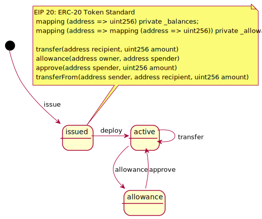

# Ethereum

<!-- toc -->

## WIP: tpl-eth-erc20-state-v1.iuml



內容

```
{{#include tpl-eth-erc20-state-v1.iuml}}
```

引用

```
!include https://dltdojo.github.io/taichu-crypto/puml/tpl-eth-erc20-state-v1.iuml
```

## TODO

- [ ] seq diagrams http://blockchainers.org/index.php/tag/erc-223/