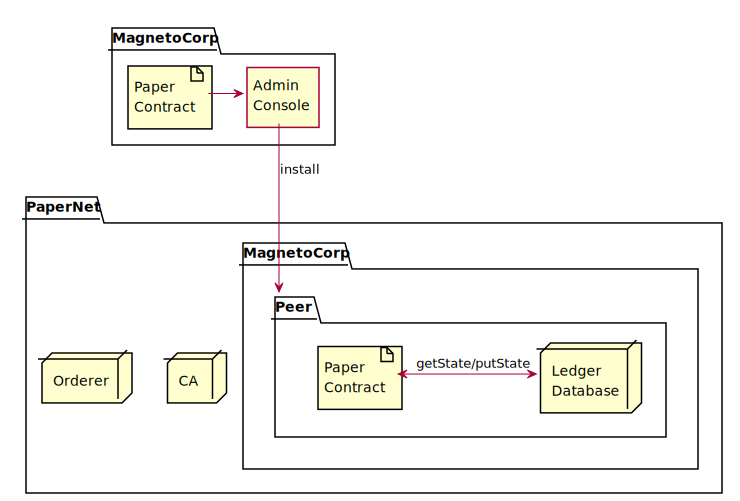
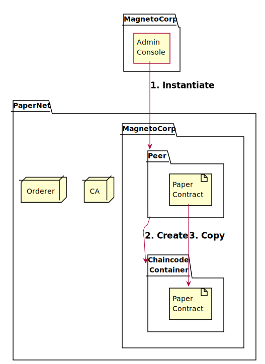
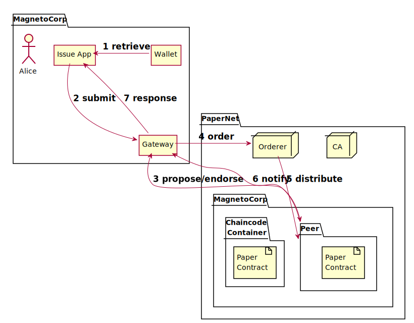
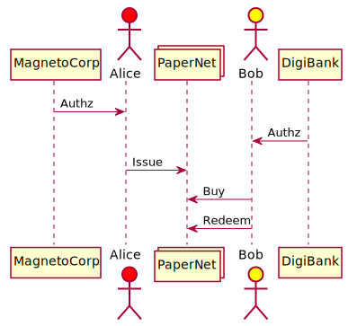
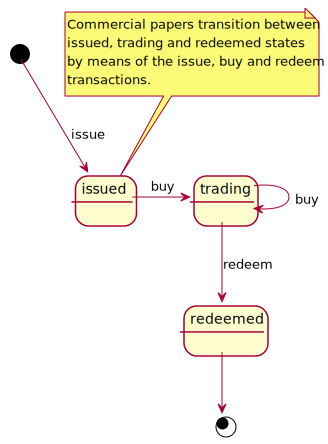
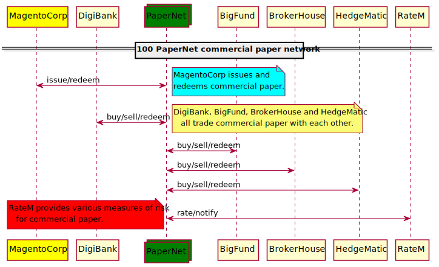

# Hyperledger Fabric

<!-- toc -->

## 安裝 tpl-hlf-cp-install-v1.iuml

[Commercial paper tutorial](https://hyperledger-fabric.readthedocs.io/en/release-1.4/tutorial/commercial_paper.html)



內容

```
{{#include tpl-hlf-cp-install-v1.iuml}}
```

引用

```
!include https://dltdojo.github.io/taichu-crypto/puml/tpl-hlf-cp-install-v1.iuml
```

## 實體化 tpl-hlf-cp-instantiate-v1.iuml

[Commercial paper tutorial](https://hyperledger-fabric.readthedocs.io/en/release-1.4/tutorial/commercial_paper.html)



內容

```
{{#include tpl-hlf-cp-instantiate-v1.iuml}}
```

引用

```
!include https://dltdojo.github.io/taichu-crypto/puml/tpl-hlf-cp-instantiate-v1.iuml
```

## 應用開發 tpl-hlf-cp-app-v1.iuml

[Commercial paper tutorial](https://hyperledger-fabric.readthedocs.io/en/release-1.4/tutorial/commercial_paper.html)



內容

```
{{#include tpl-hlf-cp-app-v1.iuml}}
```

引用

```
!include https://dltdojo.github.io/taichu-crypto/puml/tpl-hlf-cp-app-v1.iuml
```

## 系統說明 tpl-hlf-cp-seq-v1.iuml



內容

```
{{#include tpl-hlf-cp-seq-v1.iuml}}
```

引用

```
!include https://dltdojo.github.io/taichu-crypto/puml/tpl-hlf-cp-seq-v1.iuml
```

## 狀態 tpl-hlf-cp-state-v1.iuml



內容

```
{{#include tpl-hlf-cp-state-v1.iuml}}
```

引用

```
!include https://dltdojo.github.io/taichu-crypto/puml/tpl-hlf-cp-state-v1.iuml
```

## 網路 tpl-hlf-pnet-seq-v1.iuml



內容

```
{{#include tpl-hlf-pnet-seq-v1.iuml}}
```

引用

```
!include https://dltdojo.github.io/taichu-crypto/puml/tpl-hlf-pnet-seq-v1.iuml
```
