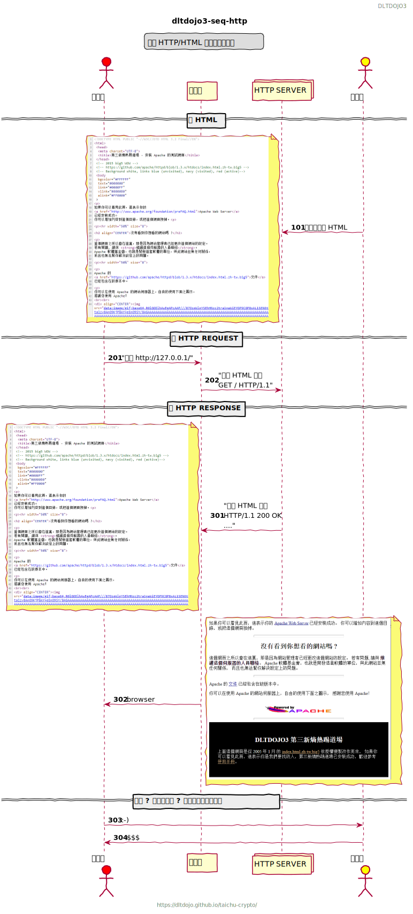
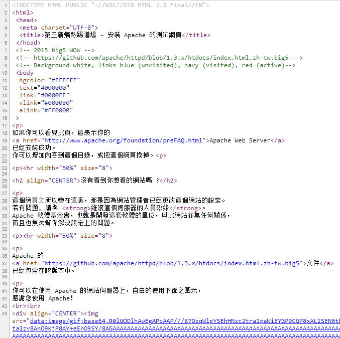

# Apache Big5
<!-- toc -->

## 一個 HTTP/HTML 網路的買賣故事



## Index of TAICHU-RAW


## HTML 表裡

[index.html of taichu-raw](taichu-raw-index.html) 為執行 taichu-raw 的預設首頁，上圖塗黑為示範效果。



## HTML 原

.big5

[httpd-1.3.x/htdocs/index.html.zh-tw.big5](httpd-1.3.x/htdocs/index.html.zh-tw.big5)

html 

[httpd-1.3.x/htdocs/index.html.zh-tw.big5](httpd-1.3.x/htdocs/index.html.zh-tw.big5.html)

## HTTP

```shell
$ cd taichu-crypto (master)
$ curl -vk https://127.0.0.1:8443
```

[curl-vk.txt](curl-vk.txt)　為 curl 對 taichu-raw 做 HTTP 通訊的往來紀錄，裡面有大量 HTML 容易引起 mdbook 錯誤解析，請開啟另外網頁查看。

### 要

```
> GET / HTTP/2
> Host: 127.0.0.1:8443
> User-Agent: curl/7.57.0
> Accept: */*
>
```

### 給

```
< HTTP/2 200 
< content-length: 5256
< date: Sat, 31 Aug 2019 04:40:02 GMT
< 
HTML BODY....
```

### 差異

- big5
- HTML5
- HTTP/2
- TLSv1.2

## PlantUML code

```
{{#include puml/seq-http.puml}}
```