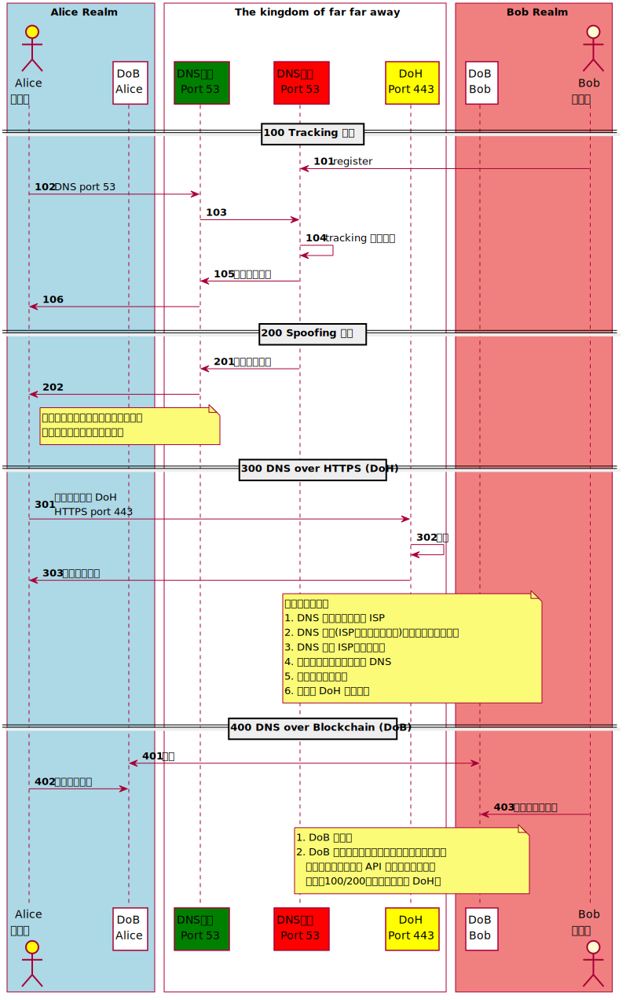

# Web Tech
<!-- toc -->

# Protocol 

## DNS-over-HTTPS (DoH)

- [A cartoon intro to DNS over HTTPS](https://hacks.mozilla.org/2018/05/a-cartoon-intro-to-dns-over-https/)
- [DNS over HTTPS: things to consider when you go private](https://blog.synology.com/dns-over-https/)
- [Firefox將預設啟用DNS-over-HTTPS](https://ithome.com.tw/news/132939)
- [DNS的未來？—談DNS-over-HTTPS及其對網路治理的意涵](https://blog.twnic.net.tw/2019/06/25/4125/)
- [Namecoin](https://en.wikipedia.org/wiki/Namecoin)
- [Ethereum Name Service](https://github.com/ensdomains)

