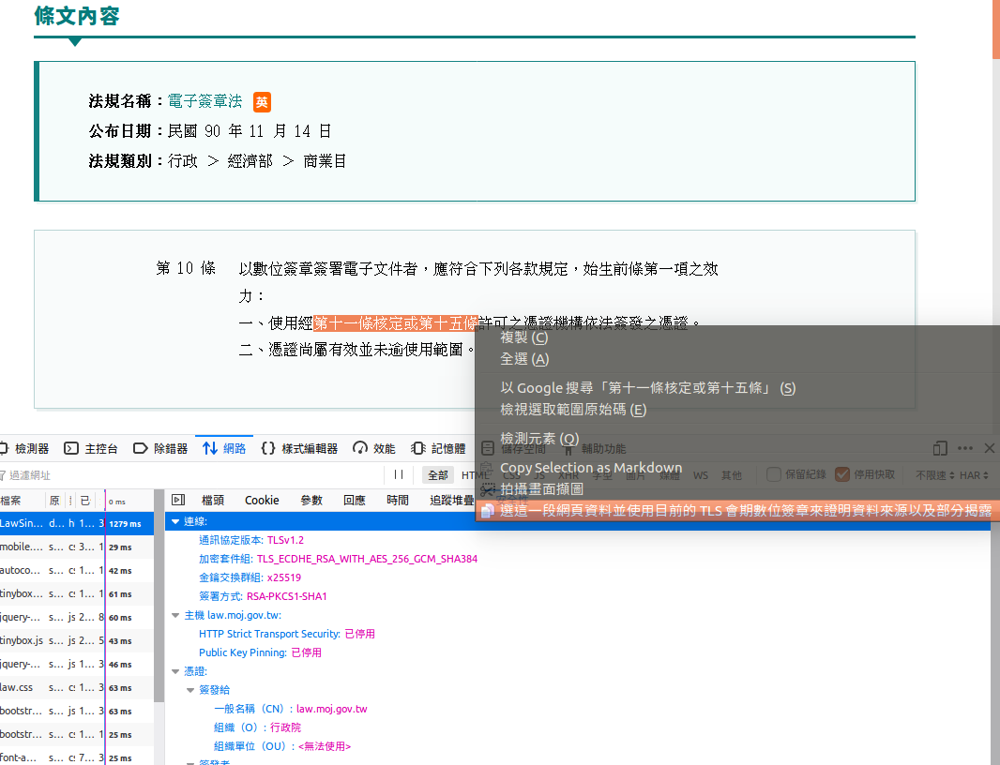

# TLS

# TOC
<!-- toc -->

# Protocol 

## DNS-over-HTTPS (DoH)

- [A cartoon intro to DNS over HTTPS](https://hacks.mozilla.org/2018/05/a-cartoon-intro-to-dns-over-https/)
- [DNS over HTTPS: things to consider when you go private](https://blog.synology.com/dns-over-https/)
- [Firefox將預設啟用DNS-over-HTTPS](https://ithome.com.tw/news/132939)
- [DNS的未來？—談DNS-over-HTTPS及其對網路治理的意涵](https://blog.twnic.net.tw/2019/06/25/4125/)
- [Namecoin](https://en.wikipedia.org/wiki/Namecoin)
- [Ethereum Name Service](https://github.com/ensdomains)


## Liberating Web Data Using Decentralized Oracles for TLS (DECO) 

> At a high level, the prover commits to a piece of data D and proves to the verifier that D came from a TLS serverSand optionally a statement πD about D. E.g., in the exampleof proving age, the statement πD could be the predicate “D=y/m/dis Alice’s date of birth andy−2019>18.”

[DECentralized Oracles DECO](https://www.deco.works/) 目前還未開源，概念是 TLS 未完待續來個三方握手，這作法對網頁服務端透明不須做另外設置，代表網頁服務端須清楚確認內容並負責任，不過對於使用者的體驗來看可直接用滑鼠選擇要證明會更方便，因為這樣可同時將外來聚合 ajax 內容納入內容來源證明裡，只要最終引入合成在瀏覽器頁面裡面的都可用瀏覽器地址上面那個 TLS 鎖頭掛的網頁服務端憑證，來證明這網頁與連帶引入的資源都由該鎖頭而起。只是當時簽發服務端憑證範圍只是認 CN 對上網域有效性，現要衍生到後面的內容存在性簽章是否有其效力待觀察。



[Liberating web data using DECO, a privacy-preserving oracle protocol](http://hackingdistributed.com/2019/09/03/DECO/) 與 [電子簽章法§10-全國法規資料庫](https://law.moj.gov.tw/LawClass/LawSingle.aspx?pcode=J0080037&flno=10) 的交互作用值得探索。

```
第 10 條 以數位簽章簽署電子文件者，應符合下列各款規定，始生前條第一項之效力：
  一、使用經第十一條核定或第十五條許可之憑證機構依法簽發之憑證。
  二、憑證尚屬有效並未逾使用範圍。
```
