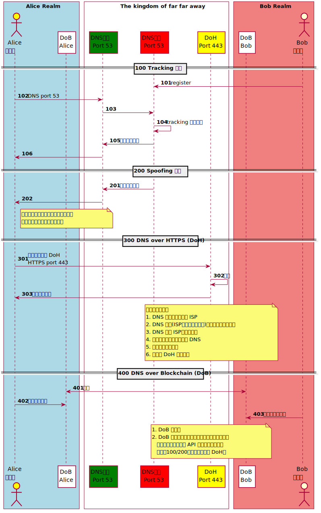

# Transport Layer Security (TLS)

[Transport Layer Security - Wikipedia](https://en.wikipedia.org/wiki/Transport_Layer_Security)

# TOC
<!-- toc -->

# Protocol 

## DNS-over-HTTPS (DoH)

- [A cartoon intro to DNS over HTTPS](https://hacks.mozilla.org/2018/05/a-cartoon-intro-to-dns-over-https/)
- [DNS over HTTPS: things to consider when you go private](https://blog.synology.com/dns-over-https/)
- [Firefox將預設啟用DNS-over-HTTPS](https://ithome.com.tw/news/132939)
- [DNS的未來？—談DNS-over-HTTPS及其對網路治理的意涵](https://blog.twnic.net.tw/2019/06/25/4125/)
- [Namecoin](https://en.wikipedia.org/wiki/Namecoin)
- [Ethereum Name Service](https://github.com/ensdomains)



## Liberating Web Data Using Decentralized Oracles for TLS (DECO) 

> At a high level, the prover commits to a piece of data D and proves to the verifier that D came from a TLS serverSand optionally a statement πD about D. E.g., in the exampleof proving age, the statement πD could be the predicate “D=y/m/dis Alice’s date of birth andy−2019>18.”

[DECentralized Oracles DECO](https://www.deco.works/) 目前還未開源，概念是 TLS 未完待續來個三方握手，這作法對網頁服務端透明不須做另外設置，代表網頁服務端須清楚確認內容並負責任，不過對於使用者的體驗來看可直接用滑鼠選擇要證明會更方便，因為這樣可同時將外來聚合 ajax 內容納入內容來源證明裡，只要最終引入合成在瀏覽器頁面裡面的都可用瀏覽器地址上面那個 TLS 鎖頭掛的網頁服務端憑證，來證明這網頁與連帶引入的資源都由該鎖頭而起。只是當時簽發服務端憑證範圍只是認 CN 對上網域有效性，現要衍生到後面的內容存在性簽章是否有其效力待觀察。


[Liberating web data using DECO, a privacy-preserving oracle protocol](http://hackingdistributed.com/2019/09/03/DECO/) 與 [電子簽章法§10-全國法規資料庫](https://law.moj.gov.tw/LawClass/LawSingle.aspx?pcode=J0080037&flno=10) 的交互作用值得探索。

```
第 10 條 以數位簽章簽署電子文件者，應符合下列各款規定，始生前條第一項之效力：
  一、使用經第十一條核定或第十五條許可之憑證機構依法簽發之憑證。
  二、憑證尚屬有效並未逾使用範圍。
```

# Tools

- [Scapy: the Python-based interactive packet manipulation program & library. Supports Python 2 & Python 3.  scapy/doc/notebooks/tls at master · secdev/scapy](https://github.com/secdev/scapy/tree/master/doc/notebooks/tls)

# TODO

## TLS Session Key Log

[NSS Key Log Format - Mozilla | MDN](https://developer.mozilla.org/en-US/docs/Mozilla/Projects/NSS/Key_Log_Format)

> Key logs can be written by NSS so that external programs can decrypt TLS connections. Wireshark 1.6.0 and above can use these log files to decrypt packets. You can tell Wireshark where to find the key file via Edit→Preferences→Protocols→SSL→(Pre)-Master-Secret log filename.

[Support for NSS's SSLKEYLOGFILE to be able to decrypt TLS traffic with TLS_ECDHE* ciphers · Issue #7795 · envoyproxy/envoy](https://github.com/envoyproxy/envoy/issues/7795)

> OpenSSL/BoringSSL applications (browsers, curl, etc) often support logging the pre-master secrets into a file by setting the SSLKEYLOGFILE environment variable. The logfile can then be easily imported into tools like Wireshark to decrypt TLS on the fly.

[Traffic tapping — envoy 1.12.0-dev-358793 documentation](https://www.envoyproxy.io/docs/envoy/latest/operations/traffic_tapping)

> The tap transport socket supports both buffered and streaming, controlled by the streaming setting. When buffering, SocketBufferedTrace messages are emitted. When streaming, a series of SocketStreamedTraceSegment are emitted.

- [Support dumping of crypto keys to an nss formated key log file · Issue #1043 · loadimpact/k6](https://github.com/loadimpact/k6/issues/1043)
- [Disable BoringSSL TLS Key Logging SSLKEYLOGFILE · Issue #3479 · brave/brave-browser](https://github.com/brave/brave-browser/issues/3479)
- [Add support for the SSLKEYLOGFILE environment variable by djc · Pull Request #171 · ctz/rustls](https://github.com/ctz/rustls/pull/171)
- [No way to set ENABLE_SSLKEYLOGFILE · Issue #2210 · curl/curl](https://github.com/curl/curl/issues/2210)
- [Feature Request: Log TLS Session Keys · Issue #632 · eclipse/mosquitto](https://github.com/eclipse/mosquitto/issues/632)


