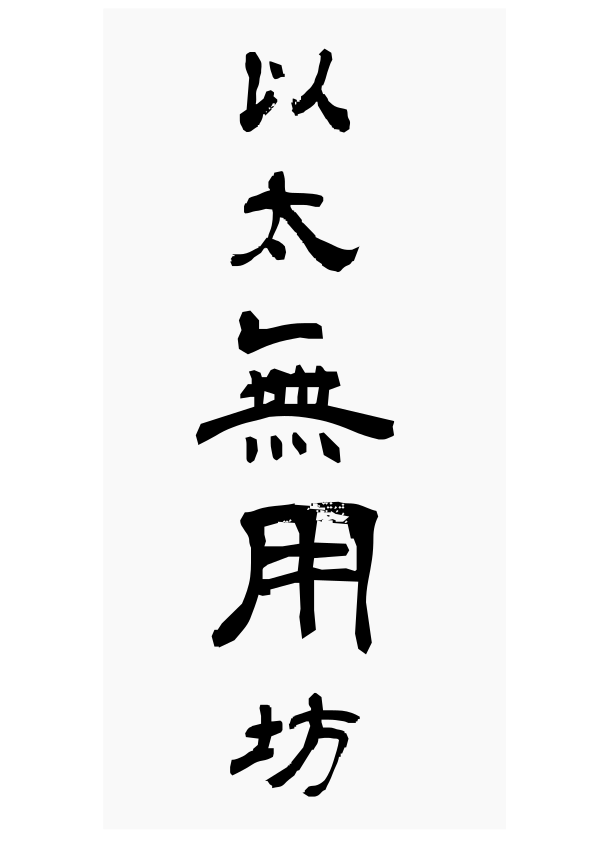

> 莊子思想中的無用，是以形體上的無用來追求不為外物所累，可是天生萬物，必有其才用，必有其器用，所以莊子追求心靈的契合大道，乘道德而浮游，不拘泥在有用無用之間，無肯專為，正如同老子思想中的守樸見素，不肯固執在一種器用之內。

目標：製作類似一九八四的比特幣金鑰書，改用暗黑通信團的圓周率與質數為底書，並掛上相對應的以太坊交易。

# 每本書附鏈上交易

- 交易壹 轉入約 200 台幣等值之以太坊
- 交易貳 轉入 UET
- 交易參 破解轉出 UET
- 交易肆 燒掉 UET
- 交易伍 製作 NFT

# 相關素材

# 相關連結

- [內容只有圓周率的書 (122297) - 癮科技 Cool3c](https://www.cool3c.com/article/122297)
- [CVE - CVE-2018-10468](http://cve.mitre.org/cgi-bin/cvename.cgi?name=CVE-2018-10468)
- [Your Tokens Are Mine: A Suspicious Scam Token in A Top Exchange | by PeckShield | Medium](https://peckshield.medium.com/your-tokens-are-mine-a-suspicious-scam-token-in-a-top-exchange-5e864075f7e9)
- [UselessEthereumToken(UET), ERC20 token, allows attackers to steal all victim’s balances (CVE-2018–10468) | by Jonghyuk Song | Coinmonks | Medium](https://medium.com/coinmonks/uselessethereumtoken-uet-erc20-token-allows-attackers-to-steal-all-victims-balances-543d42ac808e)
- [Ethereum Transaction Hash (Txhash) Details | Etherscan](https://etherscan.io/tx/0x694ea5356a0eb78d05e0bffbb63023d14a1662c1f8c95fd6aa33d9e311d7ab52)
- [莊子之無用之用的觀點](http://club.ntu.edu.tw/~davidhsu/Lao-Chuang-Lecture/discuss_3/report/ViewOfUseOfNoUse.html)
- [有用無用你懂不懂？—— 莊子哲學中的啟發 |好青年荼毒室-哲學部](https://corrupttheyouth.net/2017/01/10/1632/)
- [「青柳/衡山」五款可商用日本無料書法字型下載 | 梅問題．教學網](https://www.minwt.com/free/15577.html)

